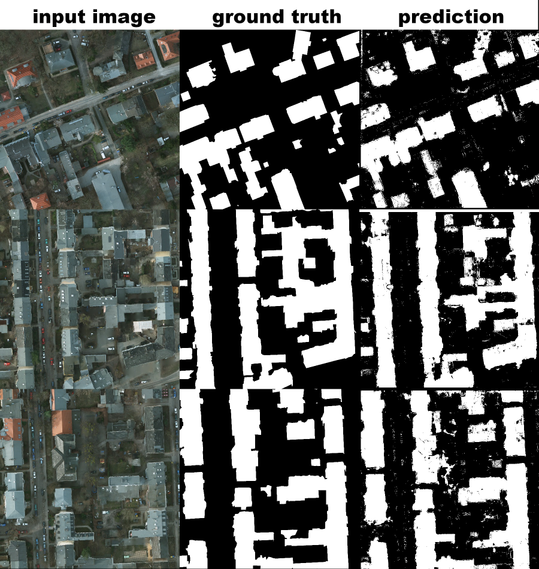

# Machine Learning - Image Segmentation

Per pixel image segmentation using machine learning algorithms. Programmed using the following libraries: Scikit-Learn, Scikit-Image OpenCV, and Mahotas and ProgressBar. Compatible with Python 2.7+ and 3.X.

### Feature vector

Spectral:

* Red
* Green
* Blue

Texture:

* Local binary pattern

Haralick (Co-occurance matrix) features (Also texture):

* Angular second moment
* Contrast
* Correlation
* Sum of Square: variance
* Inverse difference moment
* Sum average
* Sum variance
* Sum entropy
* Entropy

### Supported Learners

* Support Vector Machine
* Random Forest
* Gradient Boosting Classifier

### Example Usage

python train.py -i <path_to_image_folder> -l <path/to/label/folder> -c <SVM, RF, GBC> -o <path/to/model.p>

python inference.py -i <path_to_image_folder> -m <path/to/model.p> -o <path/to/output/folder>

python evaluation.py -i <path/to/test/images> -g <path/to/ground/truth/images> [-m]

### Example Output

